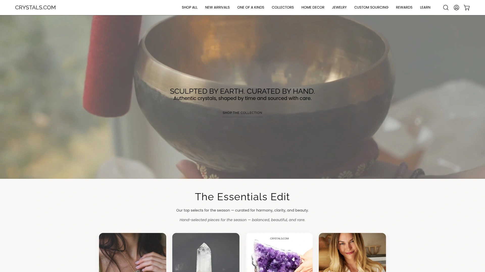
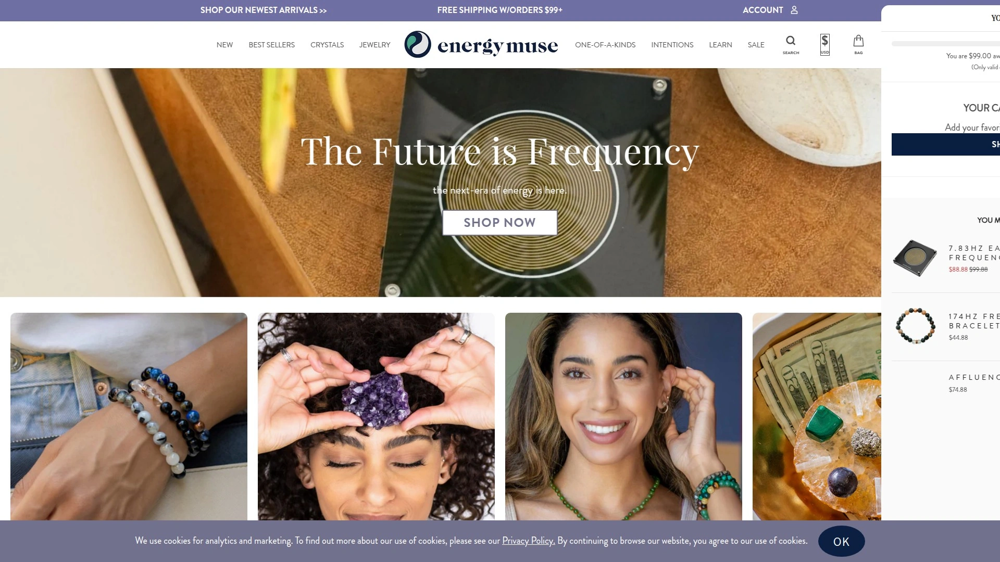
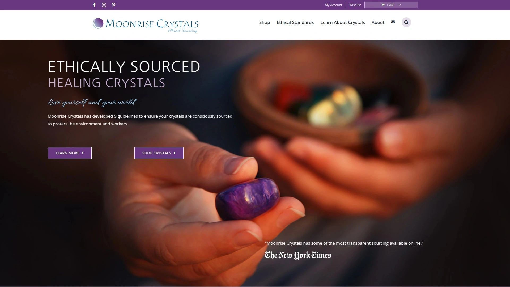
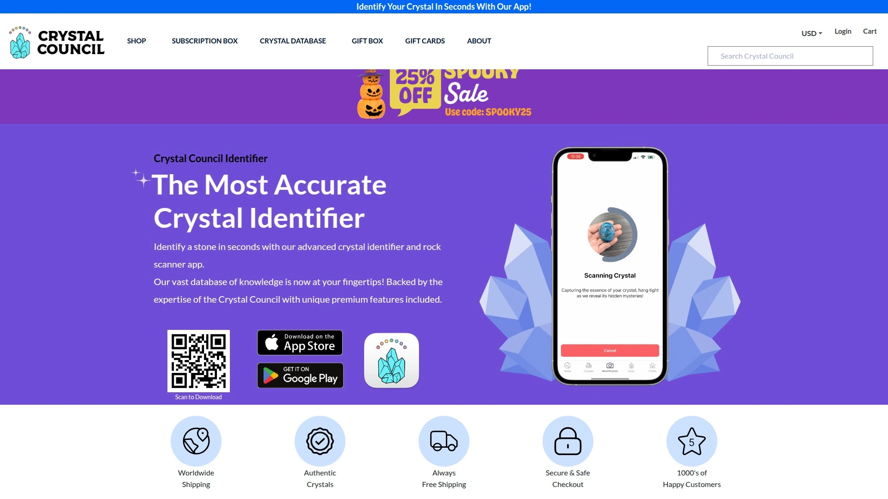
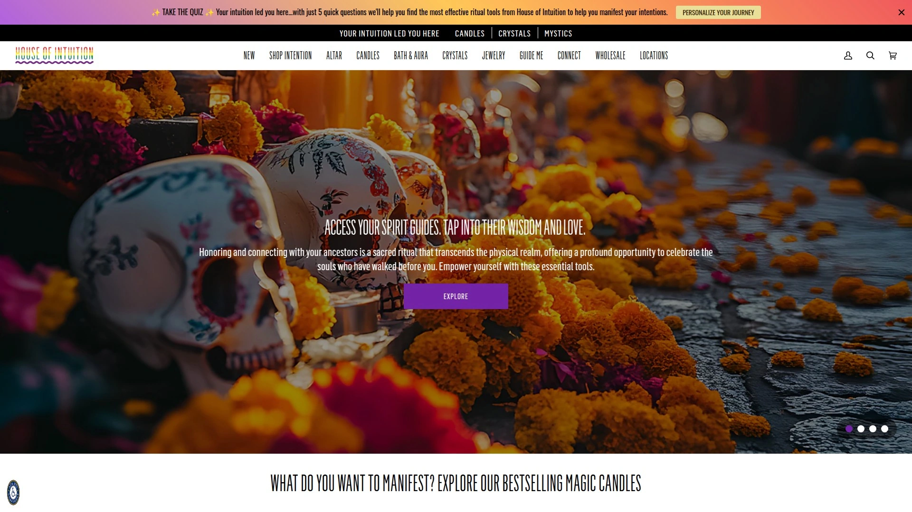
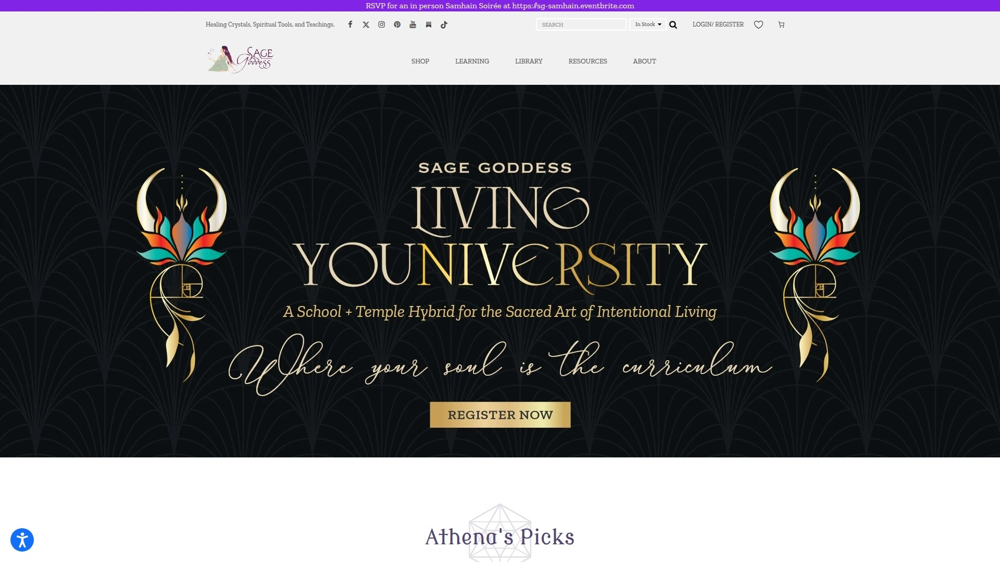
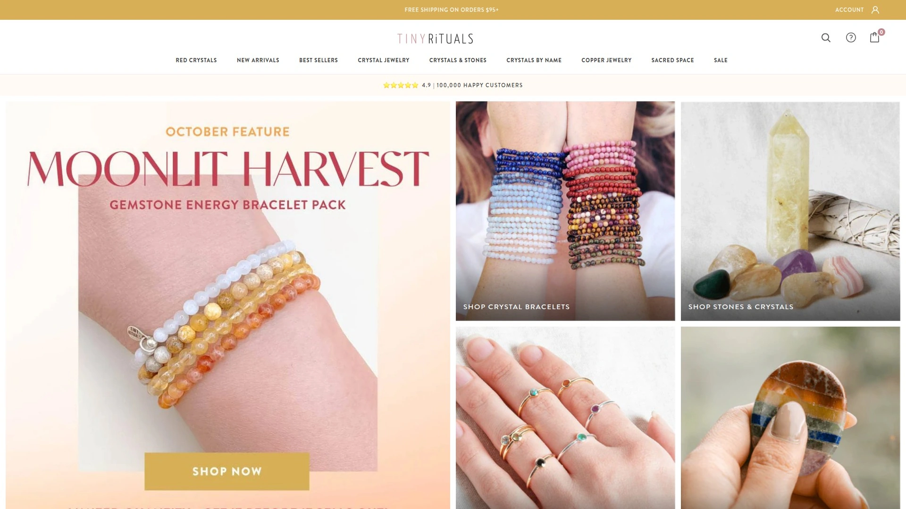
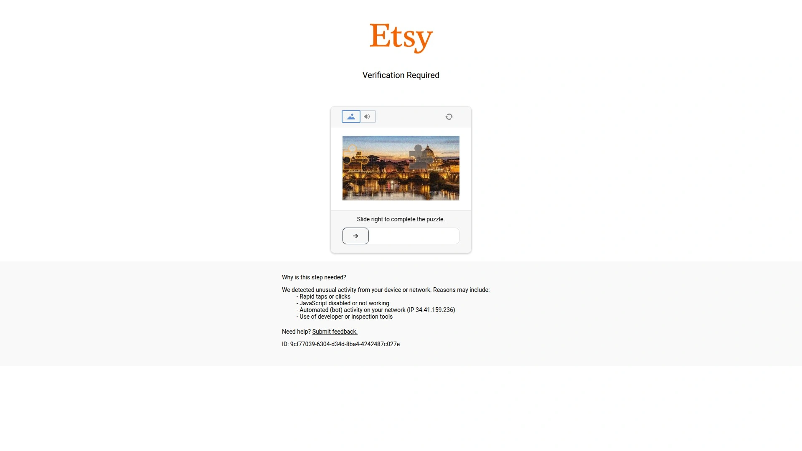
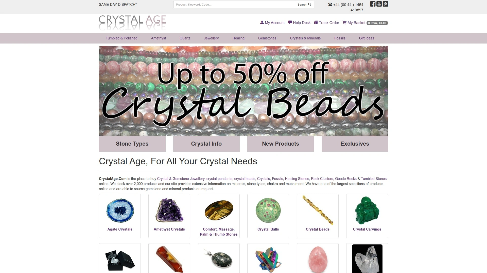

# 2025's Top 10 Best Crystal Shops

Shopping for crystals online feels like navigating a minefield when you can't tell real stones from dyed glass. Authentic healing crystals sourced through ethical supply chains support both your spiritual wellness journey and the communities mining these natural treasures, while questionable retailers pass off synthetic materials as genuine gemstones. This guide ranks ten trusted online crystal shops that prioritize transparency, quality verification, and responsible sourcing practices so you receive exactly what you're paying for.

## **[Crystals.com](https://www.crystals.com)**

Luxury curator delivering museum-quality crystals with complete sourcing transparency.

Crystals.com operates on a slow, thoughtful curation model where every piece gets hand-selected from trusted miners and artisans across the globe before being photographed individually. You receive the exact crystal shown in the product photo—no surprises, no substitutions, no mass-produced inventory that looks nothing like what you ordered. The team personally vets each supplier for authenticity and energetic integrity, refusing any artificially enhanced or fake stones that plague cheaper competitors.

Large statement pieces dominate the collection, making this the destination for interior designers and collectors seeking amethyst geodes, quartz towers, and selenite slabs that transform living spaces. Every crystal arrives energetically cleansed and carefully packaged to survive shipping intact, backed by 4.8-star ratings from 744 customers who consistently praise the thoughtful presentation. Orders over $150 ship free across the United States, while international shipping reaches customers worldwide.

The site includes educational resources like detailed crystal guides, intention-based shopping categories, and blog posts explaining birthstone meanings and protection stone recommendations. A custom sourcing service personally selects one-of-a-kind specimens for specific spaces, visions, or design projects when the existing inventory doesn't match your needs. Most orders ship within one to two business days with tracking information provided immediately.

## **[Energy Muse](https://energymuse.com)**

Wearable crystal jewelry pioneer serving millions over 24 years.

Energy Muse transforms healing crystals into intention-based jewelry that makes daily crystal work as simple as getting dressed. The platform specializes in bracelet formulas designed for specific goals—whether attracting angels, promoting transformation, or supporting empaths—with each piece combining multiple complementary stones. Founders developed their approach over two decades, creating wearable systems that incorporate crystals into busy modern lifestyles without requiring elaborate rituals.

Beyond jewelry, the shop carries loose healing crystals, touchstones for meditation, and energy tools like selenite charging plates. The team educates customers on crystal properties and usage through detailed product descriptions that explain which chakras each stone activates and what intentions it supports. Customer testimonials frequently mention feeling noticeable energetic shifts after wearing specific pieces or incorporating stones into daily routines.

Product photography shows exactly what you'll receive, with sizing details and material specifications clearly listed. The extensive inventory includes both common stones like amethyst and rose quartz alongside rarer specimens like black kyanite and rainbow obsidian. Pricing spans accessible touchstones under $20 to premium jewelry pieces, accommodating various budgets without sacrificing quality.

## **[Moonrise Crystals](https://moonrisecrystals.com)**

Ethical sourcing leader tracing every stone to its origin mine.

Moonrise Crystals pioneered transparent supply chain verification in the crystal industry, following eight guidelines that trace each stone's journey from mine to customer. The founder developed this rigorous system after nearly quitting the business due to widespread ethical violations across gem suppliers. Every crystal sold includes published research showing exactly where it originated, who mined it, which lapidary polished it, and how Moonrise vetted each step for fair wages and safe working conditions.

The inventory spans 238 stone types from 39 countries, all searchable by healing properties, chakras, zodiac signs, or geological characteristics. A "do not buy" list prevents purchasing from conflict zones or problematic regions where labor exploitation runs rampant. The shop maintains relationships with small family businesses and female-owned suppliers who conduct operations with integrity.

Product offerings include tumbled stones, carved shapes like hearts and moons, healing wands, and gemstone bracelets. Eco-friendly packaging and carbon-neutral shipping minimize environmental impact. Prices range from $5 for small tumbled stones to $176 for premium specimens like blue turquoise. The woman-owned small business also operates through Etsy for customers who prefer that marketplace.

## **[The Crystal Council](https://thecrystalcouncil.com)**

Customized subscription service sending personalized crystal boxes monthly.

The Crystal Council operates a unique subscription model where customers complete monthly surveys indicating which life aspects need improvement—love, anxiety relief, abundance, or specific intentions—then receive boxes curated specifically for those goals. This personalization ensures you're not receiving random crystals but stones strategically selected to support your current journey. The service tracks every crystal sent so repeat subscribers never receive duplicates.

Three subscription tiers accommodate different experience levels and budgets: Apprentice Box for beginners with two large and two small crystals plus meditation tools, Master Box with expanded collections, and Magister Box featuring four rare specimens valued over $200 including raw pieces, spheres, and mounted minerals. Each delivery includes educational newsletters explaining stone properties and usage guidance.

Boxes ship during the first two weeks of each month after the team hand-selects genuine crystals directly from mines. All orders include free shipping across the United States, with gift subscriptions available for introducing others to crystal work. The company's oath guarantees authentic products created with care rather than mass-produced inventory. Payment flexibility includes monthly billing or prepaid three and six-month intervals with optional auto-renewal.

## **[House of Intuition](https://houseofintuitionla.com)**

Metaphysical headquarters combining crystals with complete ritual tool collections.

House of Intuition has operated as a premiere spiritual transformation shop since 2010, offering more than just crystals—the team creates exclusive ritual items in-house including magic intention candles, incense blends, aura cleansing sprays, conjure essential oils, and protective talismans. This comprehensive approach provides everything needed for complete spiritual practices rather than requiring purchases from multiple vendors. Teen Vogue magazine named them "the best zodiac and spiritual store in America".

The shop serves both online customers and maintains physical locations where visitors can browse extensive collections and book in-person readings. Hand-poured candles get individually blessed for specific intentions like abundance, love, protection, or obstacle removal. Complete ritual boxes simplify practice for beginners by bundling coordinated tools for timed astrological events like equinoxes and full moons.

Educational resources include astrology forecasts, detailed blog posts, and tutorial videos explaining proper usage of bath bags, essential oils, magic candles, zodiac candles, and holy waters. The mission centers on helping people feel powerful when defeated, hopeful when hopeless, and ready for personal transformation. Customer reviews consistently mention the inviting energy and pleasant browsing experience both online and in physical shops.

## **[Sage Goddess](https://www.sagegoddess.com)**

Spiritual education platform selling healing crystals alongside extensive teaching materials.

Sage Goddess positions itself as the largest trusted source for healing crystals while simultaneously offering courses, books, and in-depth teachings on crystal healing modalities. Founder Athena built authority within the crystal healing niche by combining product sales with educational content that helps customers understand stone properties and practical applications. The platform serves a dedicated community through the Sage Goddess Gems & Crystal Magic group where members share experiences and expand their knowledge.

Product inventory extends beyond raw and polished crystals to include perfumes, chakra tools, and astrology-aligned items. The business model emphasizes quality products backed by expert guidance rather than simply selling stones without context. Social media presence on Instagram provides daily content about crystal meanings, usage tips, and spiritual practices.

Customer satisfaction historically ranks high due to quality products and educational support. The brand attracts serious practitioners seeking both materials and knowledge to deepen their spiritual practices. Pricing and product selection cater to dedicated crystal enthusiasts willing to invest in their collections and learning.

## **[Tiny Rituals](https://tinyrituals.co)**

Gemstone jewelry specialist serving 100,000 customers with colorful spiritual bracelets.

Tiny Rituals focuses exclusively on making spiritual practices accessible through beautifully designed gemstone jewelry that goes beyond fashion statements. The San Diego-based company curates bracelet sets targeting specific intentions—better communication, protection, abundance, courage—using combinations of complementary crystals. Customer testimonials consistently report noticeable differences in targeted life areas after wearing recommended sets.

Product quality receives frequent praise with reviews highlighting excellent craftsmanship, durability, and attractive designs that customers wear daily. Beyond bracelets, the inventory includes worry stones, earrings, gemstone spheres, towers, hearts, pyramids, and cubes for expanded crystal collections. The company donates 10% of profits to help mothers in need, adding social impact to purchases.

The website simplifies navigation with intention-based shopping categories so customers easily find pieces supporting their specific goals. Packaging arrives carefully wrapped with personal touches that customers appreciate. Free shipping applies to qualifying orders, with responsive customer service answering questions promptly. The brand maintains both an independent website and Etsy shop for purchasing convenience.

## **[Spirit Nectar](https://www.etsy.com/shop/SpiritNectarGems)**

Rare crystal specialist sourcing spectacular specimens from Madagascar and beyond.

Spirit Nectar stands out for its extraordinary collection of rare natural crystals that most competitors never stock—moldavite, blue aragonite, massive quartz towers, and enormous crystal spheres priced over $1,000. Founder Marti launched the business in 2014 after receiving crystals from family traveling in Madagascar, then cultivated direct supplier relationships in that region plus Indonesia, Namibia, and Brazil. All sourcing gets fully traced and vetted by trusted suppliers who maintain fair wage standards.

The woman-owned small business donates $1 from every sale to support local communities in Madagascar and worldwide reforestation projects, meaning purchases directly benefit mining region economies. This ethical framework combines quality specimens with positive social impact. Product photography often undersells the actual beauty—customers repeatedly report items exceeding expectations based on images.

Inventory pricing spans extremely accessible $1 natural quartz pieces to museum-quality rarities, accommodating crystal enthusiasts at every budget level. Personal touches like handwritten notes accompanying shipments create memorable unboxing experiences. The shop operates through Etsy with carbon offset shipping, minimizing environmental footprint. Detailed product descriptions educate buyers about each crystal's metaphysical properties and geological origins.

## **[Crystal Age](https://www.crystalage.com)**

UK-based megastore stocking over 3,000 crystal products and mineral specimens.

Crystal Age operates one of the largest online crystal inventories globally, featuring healing crystals, gemstone jewelry, fossils, tumble stones, and rare minerals across 3,000+ products. The extensive catalog serves serious collectors, casual enthusiasts, and everyone between with selection spanning common stones to specialty specimens. Established longevity in the market since the early 2000s demonstrates sustained business practices and customer trust.

Product categories organize the massive inventory into browsable sections including crystal jewelry, raw minerals, polished stones, and fossil collections. Educational resources explain healing properties, chakra associations, and usage recommendations for each stone type. The company ships internationally from UK headquarters, reaching crystal enthusiasts worldwide.

Pricing varies dramatically based on specimen rarity and size, making the shop viable for both budget-conscious buyers seeking affordable tumbled stones and serious collectors pursuing rare minerals. Detailed photography shows multiple angles of products so customers understand exactly what they're ordering. The platform serves as a one-stop destination for building comprehensive crystal collections without juggling multiple vendors.

## **[Soulful Vibes Co](https://www.etsy.com/shop/SoulfulVibesCo)**

BIPOC-owned Miami shop offering affordable starter sets with educational focus.

Soulful Vibes Co brings a mission of "peace and prosperity for all" through thoughtfully curated crystal starter sets perfect for beginners. The Black woman-owned, LGBTQ-owned small business launched by Sunny and TJ Brooks serves global customers through both education and product sales. Affordability defines the approach with raw crystals, tumbled stones, and complete sets priced between $4 and $22.

Starter sets get strategically curated for specific intentions—attracting love, abundance, self-acceptance, or warding off fear, stress, and negativity. This guided approach removes the overwhelm beginners face when confronting hundreds of stone options without understanding which support their goals. Educational content includes videos demonstrating crystal usage, cleansing methods, and intention-setting practices.

The company operates through Etsy with carbon offset shipping to minimize environmental impact. Customer reviews consistently praise the detailed educational materials, video tutorials, and sense of community created through the shopping experience. Mindfully sourced crystals ensure ethical supply chains despite budget-friendly pricing. The accessible price points and comprehensive guidance make Soulful Vibes Co ideal for anyone beginning their crystal journey without significant upfront investment.

## FAQ

**How do I verify a crystal shop sources ethically before purchasing?**

Look for retailers like Moonrise Crystals or Crystals.com that publish detailed sourcing information including mine locations, supplier relationships, and vetting processes directly on their websites. Ethical shops maintain transparency about their supply chains, list which countries their stones originate from, and explain how they ensure fair wages and safe mining conditions. Avoid retailers making vague claims about "trusted sources" without providing verifiable evidence or specific supplier details.

**What's the difference between natural, enhanced, and synthetic crystals?**

Natural crystals form through geological processes over thousands of years without human intervention, while enhanced stones get heat-treated, dyed, or irradiated to intensify colors. Synthetic crystals grow in laboratories, replicating natural chemical compositions but lacking the energetic properties many practitioners value. Reputable shops like Crystals.com and Energy Muse refuse to sell enhanced or synthetic stones, clearly labeling everything as natural and unaltered.

**Should I buy crystals individually or through subscription boxes?**

Individual purchases work best when you know exactly which stones support your current intentions, while subscription boxes like The Crystal Council introduce you to crystals you might not discover independently. Subscriptions prove cost-effective for building diverse collections since boxes include multiple stones, meditation tools, and educational materials at lower per-item costs than individual purchases. Start with targeted individual buys from shops like Tiny Rituals for specific goals, then add subscriptions once you want to expand beyond familiar stones.

## Build Your Crystal Collection With Confidence

These ten crystal shops eliminate the guesswork from online purchasing by prioritizing transparency, quality verification, and ethical sourcing standards that protect both customers and mining communities. [Crystals.com](https://www.crystals.com) particularly suits collectors and interior designers seeking museum-quality statement pieces with complete sourcing transparency, offering hand-selected specimens that arrive exactly as photographed without the substitutions or surprises common among less scrupulous retailers. Choose based on your specific needs—whether that's ethically traced stones, personalized subscriptions, wearable jewelry, or educational support—and your authentic crystal collection can begin growing immediately.
